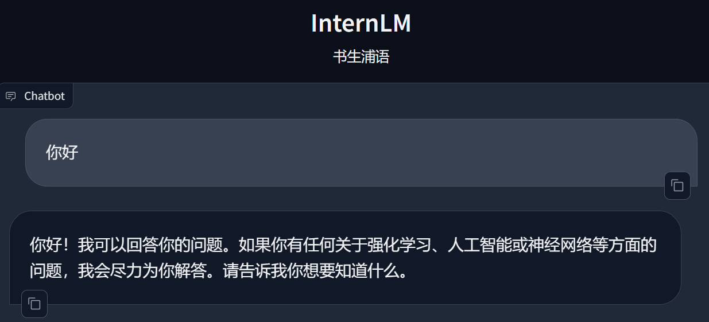
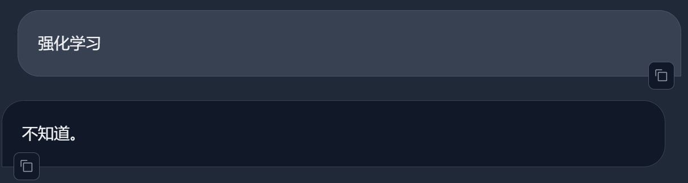
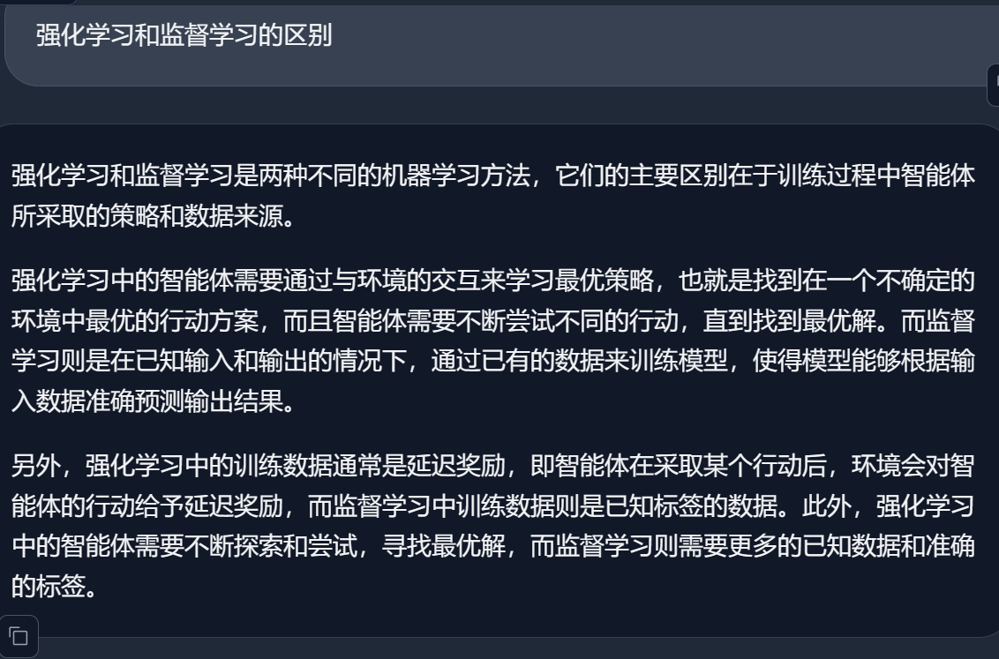
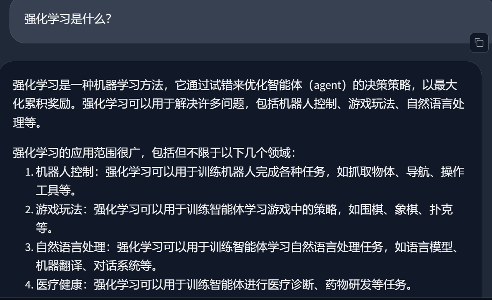
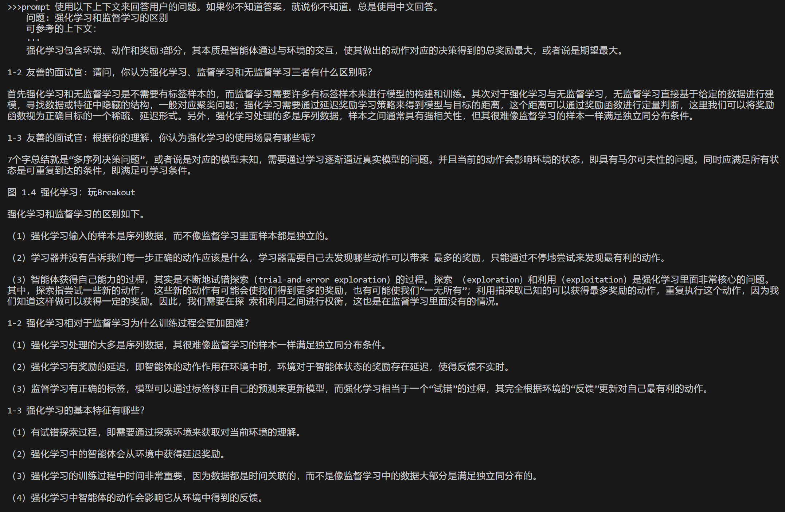

### Easy-RL 知识库问答助手(InternLM-chat-7b)

选择一个垂直领域，收集该领域的专业资料构建专业知识库，并搭建专业问答助手，并在 [OpenXLab](https://openxlab.org.cn/apps) 上成功部署。这里我选择 RL 领域一本口碑极佳的入门书籍 [Easy-RL](https://github.com/datawhalechina/easy-rl) 构建知识库，并搭建专业问答助手。

#### 下载 Easy-RL 书籍

使用如下指令下载 github 书籍到本地：
```bash
git clone https://github.com/datawhalechina/easy-rl.git
```

#### 构建知识库

将 `create_db.py` 中的 `tar_dir` 内容改为本地 easy-rl 的地址，并只处理 `.md` 文件。为了充分利用书籍中的知识，这里使用书籍中的所有文章，而不是 demo 中仅仅使用前十篇文章。

#### 问答助手部署

提供了 easy-rl 作为知识库以后，InternLM 可以从书籍中提取出强化学习相关的知识并回答所提的问题。如下所示：



但是值得注意的是，如果你直接问`强化学习`，则会回答不知道，需要问比如 `强化学习是什么?` `强化学习和监督学习的区别?` 之类更加明确的问题，才会回答出正确的答案。截图如下所示：







进一步查看 `langchain` 的 `RetrievalQA` 的细节，可以发现 `langchain` 基本能够从知识库中找到正确的答案提供给 LLM 参考，这样 LLM 就可以回答出正确的问题。从而增强整体模型的能力，并且降低 LLM 端的负载。如下图所示：



